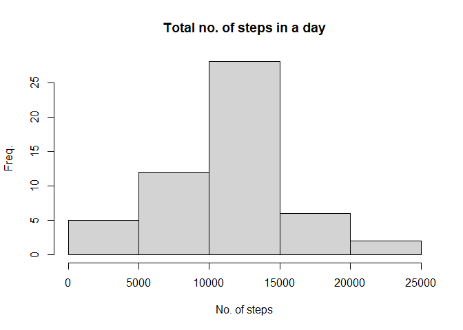
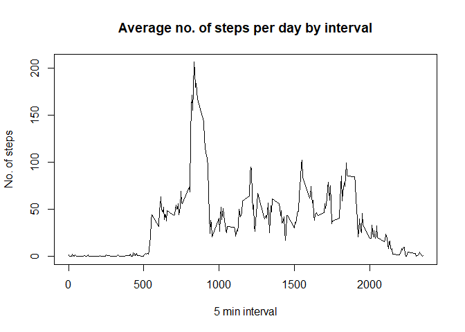
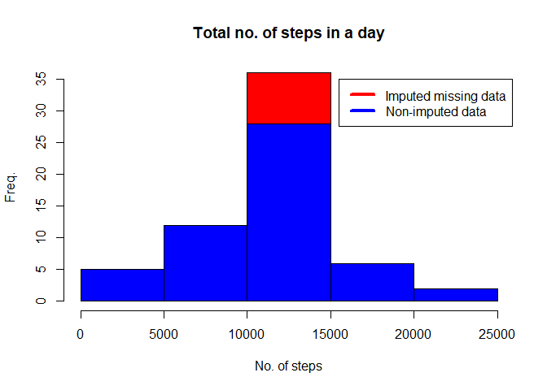
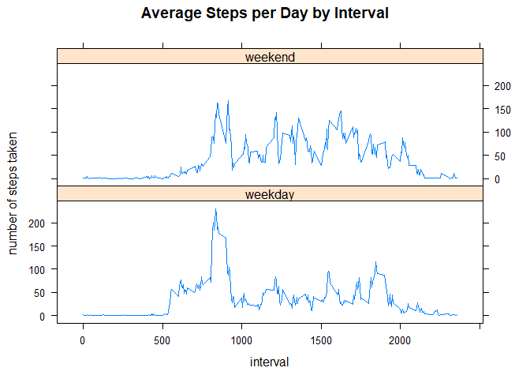

ASSIGNMENT: ACTIVITY MONITORING DATA by Muskaan

(1)Code for reading in the dataset and/or processing the data


```r
library(lattice)
setwd("~/R/Coursera 5/repdata_data_activity")
activity <- read.csv(file = 'activity.csv')
summary(activity)
```

```
##      steps            date              interval     
##  Min.   :  0.00   Length:17568       Min.   :   0.0  
##  1st Qu.:  0.00   Class :character   1st Qu.: 588.8  
##  Median :  0.00   Mode  :character   Median :1177.5  
##  Mean   : 37.38                      Mean   :1177.5  
##  3rd Qu.: 12.00                      3rd Qu.:1766.2  
##  Max.   :806.00                      Max.   :2355.0  
##  NA's   :2304
```


(2)Histogram of the total number of steps taken each day

```r
totalsteps <- aggregate(steps ~ date, activity, sum)
hist(totalsteps$steps, main = "Total no. of steps in a day",ylab="Freq.",xlab="No. of steps")
```

<!-- -->

(3)Mean and median number of steps taken each day

```r
mean_steps<-mean(totalsteps$steps)
print(paste0("Mean: ", mean_steps))
```

```
## [1] "Mean: 10766.1886792453"
```

```r
median_steps<-median(totalsteps$steps)
print(paste0("Median: ", median_steps))
```

```
## [1] "Median: 10765"
```

(4)Time series plot of the average number of steps taken

```r
intervalsteps <- aggregate(steps ~ interval, activity, mean)
plot(intervalsteps$interval,intervalsteps$steps, type="l", xlab="5 min interval", 
ylab="No. of steps",main="Average no. of steps per day by interval")
```

<!-- -->

(5)The 5-minute interval that, on average, contains the maximum number of steps

```r
int_max<-intervalsteps[which.max(intervalsteps$steps),1]
print(paste0("Interval with max steps: ", int_max))
```

```
## [1] "Interval with max steps: 835"
```
(6)Code to describe and show a strategy for imputing missing data

```r
avgsteps<- aggregate(steps ~ interval, data = activity, FUN = mean)
NAblank <- numeric()
for (i in 1:nrow(activity)) {
  s <- activity[i, ]
  if (is.na(s$steps)) {
    steps <- subset( avgsteps, interval == s$interval)$steps
  } else {
    steps <- s$steps
  }
  NAblank <- c(NAblank, steps)
}
new_activity <- activity
new_activity$steps <- NAblank
```

(7)Histogram of the total number of steps taken each day after missing values are imputed

```r
totalsteps2 <- aggregate(steps ~ date, data = new_activity, sum, na.rm = TRUE)
hist(totalsteps2$steps,col="red",main = "Total no. of steps in a day",ylab="Freq.",xlab="No. of steps")
hist(totalsteps$steps,col="blue",main = "Total no. of steps in a day",ylab="Freq.",xlab="No. of steps", add=T)
legend(15500, 35,lwd=4, c("Imputed missing data", "Non-imputed data"), col=c("red", "blue"))
```

<!-- -->

```r
#mean and median of new dataset
mean_steps2<-mean(totalsteps2$steps)
print(paste0("Mean: ", mean_steps2))
```

```
## [1] "Mean: 10766.1886792453"
```

```r
median_steps2<-median(totalsteps2$steps)
print(paste0("Median: ", median_steps2))
```

```
## [1] "Median: 10766.1886792453"
```

```r
#difference in the mean and median of the previous and new dataset  
diffmean<-mean_steps2-mean_steps
print(paste0("Difference in mean: ", diffmean))
```

```
## [1] "Difference in mean: 0"
```

```r
diffmedian<-median_steps2-median_steps
print(paste0("Difference in median: ", diffmedian))
```

```
## [1] "Difference in median: 1.1886792452824"
```
The mean is the same for both datasets.
The median for the new dataset is slightly greater than that for the old dataset.

(8)Panel plot comparing the average number of steps taken per 5-minute interval across weekdays and weekends

```r
weekdays <- c("Monday", "Tuesday", "Wednesday", "Thursday", "Friday")
new_activity$dow = as.factor(ifelse(is.element(weekdays(as.Date(new_activity$date)),weekdays), "weekday", "weekend"))
total <- aggregate(steps ~ interval + dow, new_activity, mean)
xyplot(total$steps ~ total$interval|total$dow,,layout=c(1,2), type="l", main="Average Steps per Day by Interval",xlab="interval", ylab="number of steps taken")
```

<!-- -->

